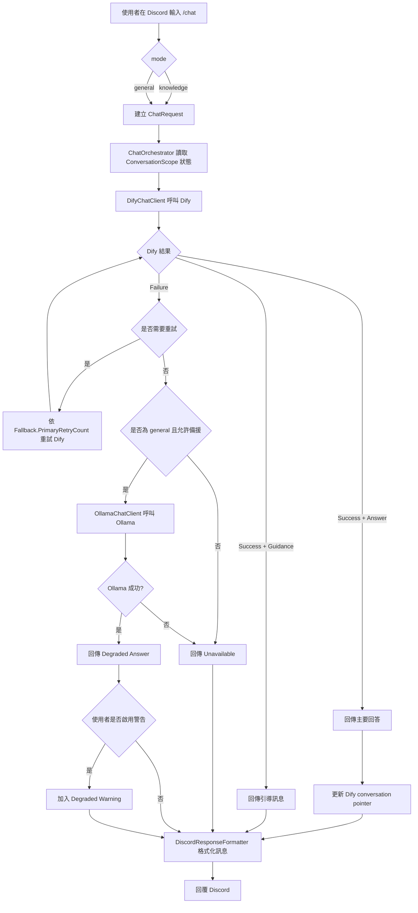

# Discord_BOT

這個專案是一個 .NET 8 Discord Bot，依照 open spec 定義實作了以下核心能力：

- 以 `/chat` 作為單一入口，透過 `mode=general|knowledge` 明確切換一般聊天與知識查詢。
- 以 Dify 作為主要提供者，處理知識型查詢與一般查詢的第一輪請求。
- 在一般聊天模式下，當 Dify 發生可重試或可備援的失敗時，退回到 Ollama 產生降級回答。
- 提供 `/checkon` 與 `/checkoff` 讓使用者控制是否顯示備援警告。

open spec 來源：

- [openspec/changes/add-discord-rag-chatbot/proposal.md](openspec/changes/add-discord-rag-chatbot/proposal.md)
- [openspec/changes/add-discord-rag-chatbot/design.md](openspec/changes/add-discord-rag-chatbot/design.md)
- [openspec/changes/add-discord-rag-chatbot/tasks.md](openspec/changes/add-discord-rag-chatbot/tasks.md)

## 系統設計流程圖



## 架構重點

### 1. Discord 指令層

[Commands/ChatModule.cs](Commands/ChatModule.cs) 提供三個 slash commands：

- `/chat`：送出聊天請求。
- `/checkon`：開啟降級回覆警告。
- `/checkoff`：關閉降級回覆警告。

`/chat` 會把 Discord interaction 轉成 `ChatRequest`，帶入使用者、頻道、執行緒、語系與 mode 等資訊，再交給 orchestrator 處理。

### 2. 協調層

[Services/ChatOrchestrator.cs](Services/ChatOrchestrator.cs) 是整個流程的決策核心：

- 先以 Dify 當 primary provider。
- 若 Dify 成功且為 `Answer`，更新會話指標。
- 若 Dify 成功但內容不足，回傳 `Guidance`，不做 fallback。
- 若 Dify 失敗且屬於可重試錯誤，先重試一次。
- 僅當 `mode=general` 且錯誤類型允許時，才會 fallback 到 Ollama。
- `mode=knowledge` 永遠不會 fallback 到 Ollama，避免把知識查詢降級成無依據回答。

### 3. Provider 層

- [Clients/DifyChatClient.cs](Clients/DifyChatClient.cs)：呼叫 Dify `chat-messages` 類型 API，並把 HTTP 結果標準化成內部模型。
- [Clients/OllamaChatClient.cs](Clients/OllamaChatClient.cs)：在備援模式下呼叫 Ollama 產生簡短回答。

### 4. 狀態與偏好

- [Stores/InMemoryConversationStateStore.cs](Stores/InMemoryConversationStateStore.cs)：以記憶體保存 Dify conversation pointer。
- [Stores/InMemoryUserPreferenceStore.cs](Stores/InMemoryUserPreferenceStore.cs)：保存是否顯示 degraded warning。

目前這兩個 store 都是 in-memory，程式重啟後資料不會保留。

## 執行流程說明

### 一般聊天模式

1. 使用者執行 `/chat mode:general prompt:...`。
2. Bot 先向 Dify 發送請求。
3. 若 Dify 暫時失敗，依設定重試。
4. 若仍失敗且屬於允許備援的錯誤，改由 Ollama 回答。
5. 若使用者已啟用警告，Discord 回覆前會加上備援提示。

### 知識查詢模式

1. 使用者執行 `/chat mode:knowledge prompt:...`。
2. Bot 只會使用 Dify。
3. 若 Dify 沒有足夠上下文，回傳引導訊息，請使用者補充更精確的文件名、條文或關鍵字。
4. 若 Dify 失敗，直接回傳暫時無法使用，不會 fallback 到 Ollama。

## 需求環境

- .NET SDK 8.0
- 一個 Discord Bot Token
- 一個可用的 Dify 應用程式與 API Key
- 本機或可連線的 Ollama 服務

## 設定方式

建議不要把敏感資訊直接寫進版本控制中的設定檔，改用 User Secrets 或環境變數覆蓋。

### 建議設定欄位

```json
{
  "DiscordBot": {
    "Token": "<your-discord-bot-token>",
    "DevelopmentGuildId": 123456789012345678
  },
  "Dify": {
    "BaseUrl": "https://api.dify.ai/v1/",
    "ApiKey": "<your-dify-api-key>",
    "ChatPath": "chat-messages",
    "UserPrefix": "discord",
    "NoAnswerMarkers": [
      "not enough context",
      "查無足夠資訊",
      "沒有足夠資訊"
    ]
  },
  "Ollama": {
    "BaseUrl": "http://localhost:11434/",
    "GeneratePath": "api/generate",
    "Model": "qwen2.5:7b-instruct",
    "MaxOutputCharacters": 1200
  },
  "Fallback": {
    "PrimaryRetryCount": 1,
    "DifyTimeoutSeconds": 20,
    "OllamaTimeoutSeconds": 35,
    "GuidanceMessage": "目前沒有足夠依據可以可靠回答，請提供更具體的文件名、條文或關鍵字。",
    "UnavailableMessage": "主要服務暫時無法使用，請稍後再試。",
    "DegradedWarningMessage": "警告：目前使用備援模式，以下回覆可能較簡化，且不一定依據知識庫內容。"
  }
}
```

### 使用 User Secrets

在專案根目錄執行：

```powershell
dotnet user-secrets set "DiscordBot:Token" "<your-discord-bot-token>"
dotnet user-secrets set "Dify:ApiKey" "<your-dify-api-key>"
```

如果你只想在特定伺服器測試 slash commands，請設定 `DiscordBot:DevelopmentGuildId`，這樣啟動時會只註冊到該 guild；未設定時則會走全域註冊。

## 啟動方式

### 1. 還原與建置

```powershell
dotnet restore
dotnet build
```

### 2. 啟動 Ollama

確認 Ollama 已經啟動，而且指定模型已可用，例如：

```powershell
ollama serve
ollama pull qwen2.5:7b-instruct
```

### 3. 啟動 Bot

```powershell
dotnet run
```

當 [Services/DiscordBotService.cs](Services/DiscordBotService.cs) 偵測到 `DiscordBot:Token` 已設定後，會登入 Discord、載入 slash commands，並在 `Ready` 事件時註冊指令。

## Discord 指令使用說明

### `/chat`

格式：

```text
/chat mode:<general|knowledge> prompt:<你的問題>
```

範例：

```text
/chat mode:general prompt:幫我整理今天會議重點
/chat mode:knowledge prompt:請根據知識庫說明請假流程
```

### `/checkon`

開啟降級模式警告。之後若回答來自 Ollama 備援，回覆前會加上警告文字。

### `/checkoff`

關閉降級模式警告。之後即使進入備援模式，也只顯示回答內容。

## 回覆類型說明

- `Answer`：正常回答，可能來自 Dify，也可能是一般模式下的 Ollama 備援。
- `Guidance`：Dify 認定資料不足，要求使用者提供更精確資訊。
- `Unavailable`：服務暫時無法使用，例如主要 provider 超時、配額問題或設定錯誤。

## 測試

執行測試：

```powershell
dotnet test .\Discord_BOT.Tests\Discord_BOT.Tests.csproj
```

如果 Windows 上有執行中的 `Discord_BOT.exe` 導致 apphost 被鎖住，可改用：

```powershell
dotnet test .\Discord_BOT.Tests\Discord_BOT.Tests.csproj --no-restore /p:UseAppHost=false
```

目前測試覆蓋的重點包括：

- 一般模式在 Dify 可重試失敗後 fallback 到 Ollama。
- 知識模式失敗時不 fallback。
- no-answer 會回傳 guidance。
- degraded warning 會依使用者偏好決定是否顯示。
- locale 會傳入 Dify 與 Ollama 請求內容。

## 目前限制

- conversation state 與使用者偏好目前為記憶體儲存，重啟後會遺失。
- Ollama 只作為一般聊天的降級備援，不提供知識庫 grounding。
- slash command 目前以 Worker Host 啟動，尚未加入更完整的部署與監控配置。